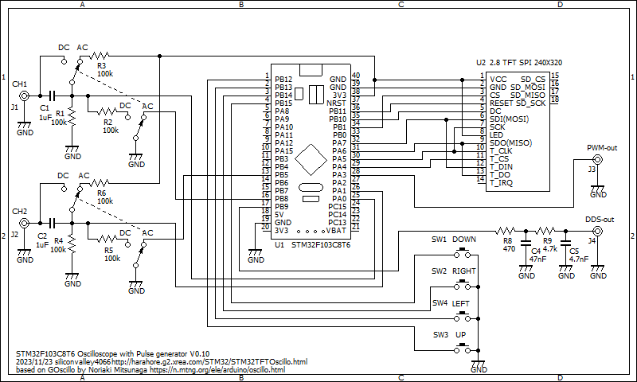

# STM32F103C8T6TFTOscilloscope
STM32F103C8T6 TFT dual channel oscilloscope with Pulse Generator, DDS Function Generator

This displays an oscilloscope screen on a 320x240 TFT LCD.
The settings are controled on the touch screen of the TFT LCD and by the 5 direction switch.
It contains Pulse Generator and DDS Function Generator.

Specifications:
<li>Dual input channel</li>
<li>Input voltage range 0 to 3.3V</li>
<li>12 bit ADC 5.14 Msps single channel, 2.57 Msps dual channel</li>
<li>timebase magnification x2, x5 and x10 applying sin(x)/x interpolation</li>
<li>Measures minimum, maximum and average values</li>
<li>Measures frequency and duty cycle</li>
<li>Spectrum FFT analysis</li>
<li>Sampling rate selection</li>
<li>Built in Pulse Generator</li>
<li>Built in DDS Function Generator</li>
 

Develop environment is: 
Arduino IDE 1.8.19 
STM32F1xx/GD32F1xx boards by stm32duino version 2022.9.26 
  (additional URL: http://dan.drown.org/stm32duino/package_STM32duino_index.json ) 
CPU speed 72MHz 

Libraries: 
Adafruit_ILI9341 
XPT2046_Touchscreen 
arduinoFFT by Enrique Condes 2.0.0 

There are conflicts with the swap macro in Adafruit_GFX_AS.h and the private function swap in arduinoFFT.h.  You have to edit the library source code arduinoFFT.h and place a line at the top as following: 
#undef swap 

Schematics: 

Description is here, although it is written in Japanese language:
http://harahore.g2.xrea.com/STM32/STM32TFTOscillo.html
