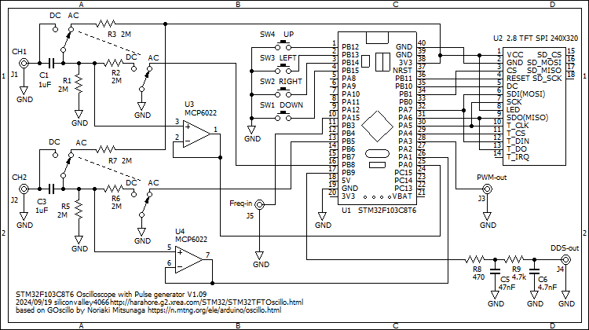

# STM32F103C8T6TFTOscilloscope
STM32F103C8T6 TFT dual channel oscilloscope with Pulse Generator, DDS Function Generator

This displays an oscilloscope screen on a 320x240 TFT LCD.
The settings are controled on the touch screen of the TFT LCD and by the 5 direction switch.
It contains Pulse Generator, DDS Function Generator and Frequency Counter.

Develop environment is: 
Arduino IDE 1.8.19 
STM32F1xx/GD32F1xx boards by stm32duino version 2022.9.26 
  (additional URL: http://dan.drown.org/stm32duino/package_STM32duino_index.json ) 
CPU speed 72MHz 

Libraries: 
Adafruit_ILI9341 
XPT2046_Touchscreen 
arduinoFFT by Enrique Condes 1.6.1 

Schematics: 

Description is here, although it is written in Japanese language:
http://harahore.g2.xrea.com/STM32/STM32TFTOscillo.html
